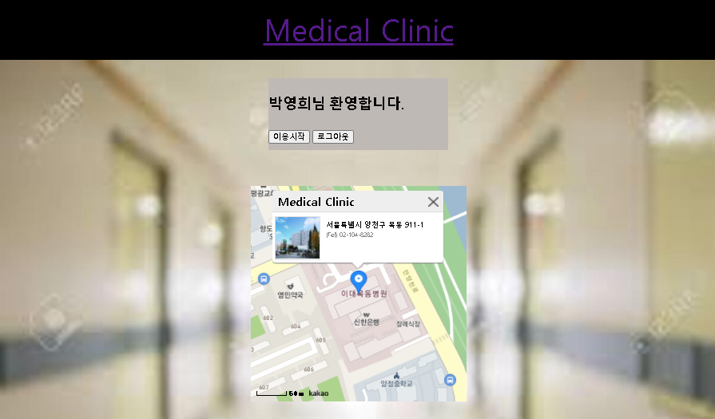
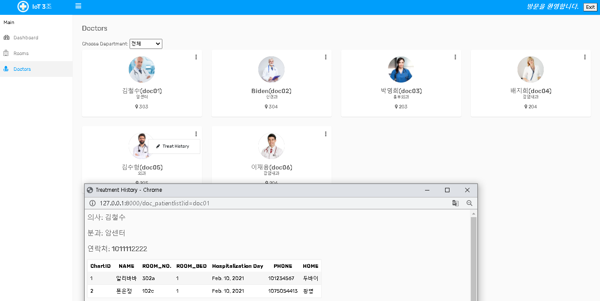

# READ ME

[1. Title](#title)

[2. Outline](#outline)

[3. Tech Stack](#tech-stack)

[4. DB](#DB)

[5. Web Page Structure](#web-page-structure)

[6. Demonstration](#demonstration)

---

## Title

- 슬기로운 병원 생활

## Outline

- 주제 : 실시간 병원 알림 시스템
- 내용 : 환자, 의사 정보를 관리 및 저장하고 Web page를 통하여 시각적으로 정보 제공
  - 병실의 환자 수 실시간 확인 가능
  - 담당 의사 정보 실시간 확인 가능
  - 환자 정보 실시간 확인 가능
- 기대효과 : 상용 시 기대효과로는 다음이 있다.
  - 입원을 희망하는 환자가 사전에 병원 현황을 파악하여 대기 기간을 단축할 수 있다.

## Tech Stack

- Python 3.6
- Django Framework

- MariaDB (HeidiSQL)
- HTML5 / CSS / JS

- Bootstrap (https://www.templateshub.net/demo/?theme=Preclinic-Hospital-Bootstrap4-Admin)
- HighCharts (https://www.highcharts.com/demo/pie-semi-circle)

## DB

- 환자가 진료를 보면 진료 레코드가 생성되고 환자의 일일, 시간별 건강 상태를 체크하여 기록하면 차트 레코드가 생성됨

- Table 구성

  - 담당의(doctor)

  - 환자(patient)
  - 진료(treatment)
  - 차트(chart)
  - 질병(disease)
  - 병실(room)
- 병실상세(roomdetail)

- DB생성 파일 링크
  - [hospital_v06.sql](https://github.com/gioan92/hospital_management/blob/master/hospital_v06.sql)

## Web Page Structure

- base.html에서 기능별로 page를 section에 출력하는 구조
- 로그인 여부에 따라 출력 정보에 차이가 있음

    

## Demonstration

- Login

  - 초기화면

  

      
  

  - 로그인 성공

  

      
  

  - 로그인 실패
    - 팝업 후 초기화면으로 돌아감

  

      
  

  

  ---

  

- Dashboard

  - 의사, 환자 수, 병실 침대 여석 비율, 입원환자 질병 통계 그래프를 시각적으로 제공

  

      
  

  

  ---

  

- Rooms

  - 꽉찬 병실은 주황 표시
  - 병실 상세(팝업)로 환자 정보 확인 가능(tooltip 기능)

  

      
  

  

      
  

---

- Doctors
  - 우상단의 로그인 유저 정보와 일치하는 데이터만 편집 가능
  - 분과 선택시 음영 표시, 진료/차트 데이터 추가, 진료 히스토리 조회, 의사 정보 삭제 기능

    

    

    

---

- Patients

  - 차트 조회(팝업), 환자 정보 삭제 기능

  

      
  

  

      
  

---

- Guest
  - Dashboard는 로그인 유저 화면과 동일
  - 병실 상세 환자 정보 조회 불가능
  - 의사 진료, 차트 추가 불가능, 차트 조회만 가능

    

    

    

